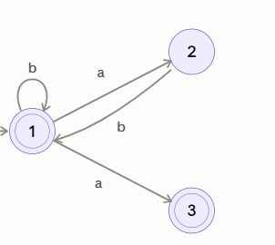
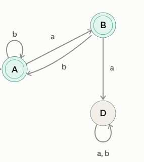

# Assignment 2

Exercise 3.2
The regex we wrote: 
(b | ab)* (a | ε)

Exercise 3.3
The string is the following:
let z = (17) in z + 2 * 3 end EOF 

At each step, we translate the rightmost nonterminal as shown in the language in 3.6.5.

Main = expr EOF -> A

Let Name EQ Expr In Expr end EOF -> F
inside the let we go from right to left as well.
The let consists of the following:
NAME, Expr2, Expr1

we look at expr1, now as expr.
Expr = z + 2 * 3 = Expr PLUS Expr -> H  

We now look at the rightmost Expr.
Expr = 2*3 = Expr TIMES Expr -> G
Rightmost Expr = 3 = CSTINT -> C
2nd rightmost Expr = 2 = CSTINT -> C

We now go back to look at the 2nd rightmost expr in Add.
expr = z = NAME -> B

Then we go back to the 2nd rightmost in the let.
expr = (17) = LPAR Expr RPAR -> E -> C

Since the NAME in the start of the let is not an expr, we don't translate it

Rightmost derivation:
A -> F -> H -> -> G -> C -> C -> B -> E -> C

